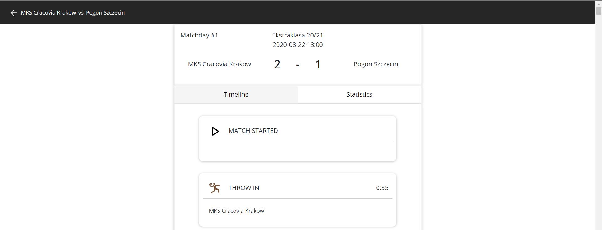
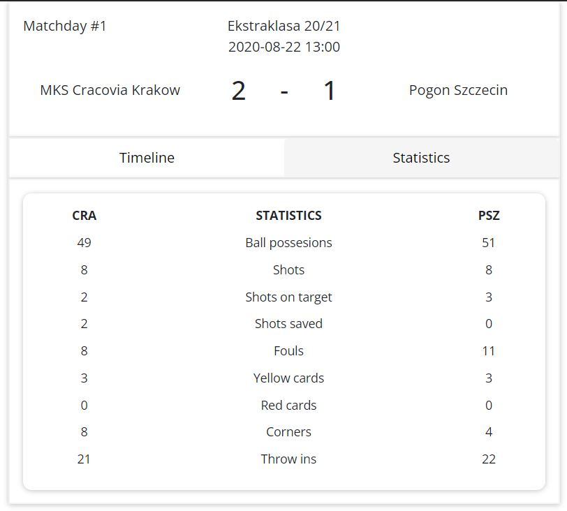
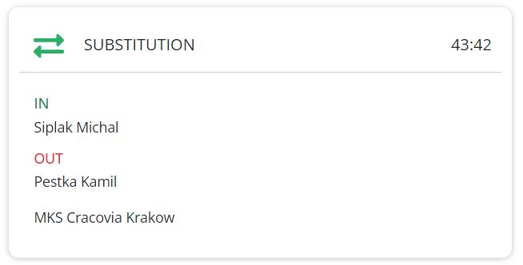
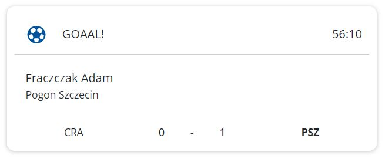

# Sportradar-Coding-Academy
Football App for Ekstraklasa league.

Application shows data for picked season.
- Match competitors
- Result
- Date
- Half Time Score
- Stadium

After pressing on specific match, user is routed to match details page. This page shows more data about the match including timeline events and statistics. Scrolling down triggers alternative navbar to show. User can press on alternative navbar to get to the top of the page without scrolling.
Special events, such as substitution or goal have its own styling.

# IMPORTANT!
Please keep in mind that API key may be expired. If so, you can get your free trial API key here: https://developer.sportradar.com/io-docs

if CORS Policy is blocking the app, please use MOESIF or any other CORS plugin (https://chrome.google.com/webstore/detail/moesif-origin-cors-change/digfbfaphojjndkpccljibejjbppifbc)
